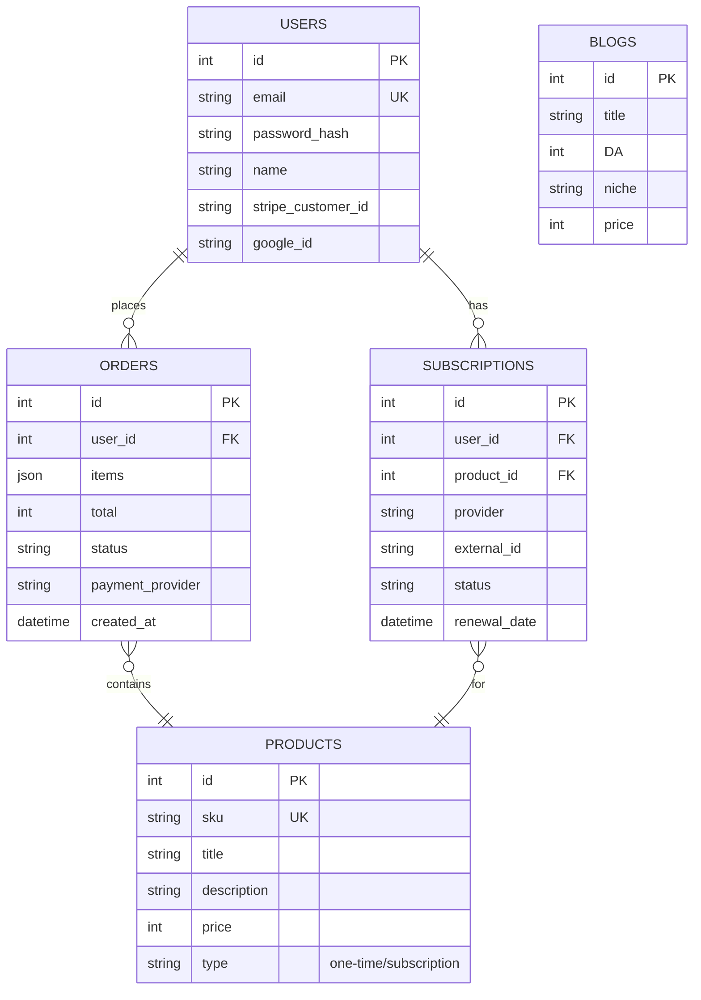

# Database Schema & TypeORM Plan

This document outlines the initial PostgreSQL database schema for the core entities required in Phase 1, as defined in the PRD. It includes conceptual schemas and basic TypeORM entity definitions.

## 1. Core Entities

Based on the PRD, the initial focus is on `Users`, `Products`, `Orders`, and `Blogs`.

## 2. Schema Diagram (Mermaid)

This diagram illustrates the high-level relationships between the core entities.



## 3. TypeORM Entity Definitions (Conceptual)

Below are the conceptual structures for the TypeORM entities. The actual implementation will include decorators (`@Entity`, `@Column`, `@ManyToOne`, etc.).

### User (`user.entity.ts`)

```typescript
import { Entity, PrimaryGeneratedColumn, Column, CreateDateColumn, UpdateDateColumn, OneToMany } from 'typeorm';
import { Order } from './order.entity';

@Entity('users')
export class User {
  @PrimaryGeneratedColumn()
  id: number;

  @Column({ unique: true })
  email: string;

  @Column({ nullable: true })
  password_hash: string;

  @Column()
  name: string;

  @Column({ nullable: true })
  google_id: string;

  @Column({ nullable: true })
  stripe_customer_id: string;

  @OneToMany(() => Order, order => order.user)
  orders: Order[];

  @CreateDateColumn()
  created_at: Date;

  @UpdateDateColumn()
  updated_at: Date;
}
```

### Product (`product.entity.ts`)

```typescript
import { Entity, PrimaryGeneratedColumn, Column } from 'typeorm';

export enum ProductType {
  ONE_TIME = 'one-time',
  SUBSCRIPTION = 'subscription',
}

@Entity('products')
export class Product {
  @PrimaryGeneratedColumn()
  id: number;

  @Column({ unique: true })
  sku: string;

  @Column()
  title: string;

  @Column('text')
  description: string;

  @Column() // Price in cents
  price: number;

  @Column({
    type: 'enum',
    enum: ProductType,
    default: ProductType.ONE_TIME,
  })
  type: ProductType;
}
```

### Order (`order.entity.ts`)

```typescript
import { Entity, PrimaryGeneratedColumn, Column, CreateDateColumn, ManyToOne } from 'typeorm';
import { User } from './user.entity';

@Entity('orders')
export class Order {
  @PrimaryGeneratedColumn()
  id: number;

  @ManyToOne(() => User, user => user.orders)
  user: User;

  @Column('jsonb') // Store order items as JSON
  items: any[];

  @Column() // Total in cents
  total: number;

  @Column({ default: 'pending' })
  status: string;

  @Column()
  payment_provider: string;

  @CreateDateColumn()
  created_at: Date;
}
```

### Blog (`blog.entity.ts`)

```typescript
import { Entity, PrimaryGeneratedColumn, Column } from 'typeorm';

@Entity('blogs')
export class Blog {
  @PrimaryGeneratedColumn()
  id: number;

  @Column()
  title: string;

  @Column()
  DA: number; // Domain Authority

  @Column()
  niche: string;

  @Column()
  language: string;

  @Column() // Price in cents
  price: number;

  @Column({ default: true })
  is_available: boolean;
}
```

This schema provides a solid foundation for Phase 1 development. It can be extended in later phases to include more complex entities like `Invoices`, `Subscriptions`, and `Projects`.